# InduSpecSmith AI

**Evidence-Only Industrial Product Enrichment**


InduSpecSmith AI transforms a raw 6-column industrial product feed into a complete
252-column UniLog Delivery Format catalog — using a fully deterministic,
rule-based pipeline that **never invents a value**. Every enriched field is either
copied verbatim from the input, deterministically normalized from an exact token
found in the product description, or left honestly blank. The result is an
auditable, byte-for-byte reproducible enrichment system with zero hallucinated
content, verified by a 140-test suite and a hard evaluation gate.

---

## 🚀 Live Demo

👉 **([Open InduSpecSmith AI](https://induspecsmithai-2fbxl9oe6qh4qx3tutmjxp.streamlit.app/))**

## Live Demo

**Live Application:** [Open InduSpecSmith AI](YOUR_STREAMLIT_URL)

> **Note:** The hosted Streamlit application may occasionally enter a sleep
> state after a period of inactivity. If the "This app has gone to sleep"
> screen appears, click **"Yes, get this app back up!"** and the application
> will restart automatically.
> 
> 


### Demo & Verification

The submitted demo video showcases the complete working application and its
core functionality.

**Key Validation Results:**
- 1,000 input products processed
- 6 input columns → 252 delivery-format columns
- 140/140 automated tests passing
- Evaluation verdict: PASS
- Zero inferred values
- Human-review workflow for flagged records

---

## 🏆 Project Overview

Industrial distributors sit on millions of sparse product records: a part number,
a terse free-text description, and placeholder brand fields. Turning those into a
publishable catalog record requires filling up to **252 structured fields** —
taxonomy, normalized attributes with units of measure, five differently formatted
descriptions, item features, digital-asset references, and commercial data.

That transformation is hard for three reasons:

1. **The evidence is tiny.** The entire input is one free-text description line.
   Everything else must be *derived* from it or stay empty.
2. **The schema is rigid.** The UniLog Delivery Format demands exact column names,
   exact order, character limits per description field, and label/value/UOM
   attribute triples — 50 slots deep.
3. **Wrong values are worse than missing values.** A fabricated voltage rating or
   a made-up manufacturer URL doesn't just look bad — it propagates into procurement
   systems, e-commerce listings, and safety documentation.

**InduSpecSmith AI takes the opposite approach from typical LLM-based enrichment:**
it refuses to guess. Every output value carries provenance. Unsupported fields are
emitted blank — deliberately, measurably, and verifiably (`INFERRED = 0`).

| | |
|---|---|
| **Input** | `Unihack_ Sample Dataset - Input.csv` — 1,000 products × 6 columns |
| **Output** | `Unihack_Delivery_Output.csv` — 1,000 products × 252 columns |
| **Method** | Deterministic rules, regex/token extraction, curated reference tables |
| **Guarantee** | Zero unsupported ("INFERRED") values; positional integrity; byte-identical reruns |

---

## 🎯 Problem Statement

Given the provided dataset, enrich 1,000 industrial product records into the
UniLog Delivery Format under these constraints:

- **Input evidence per row** is limited to six columns:
  `Mfg_Part_Num`, `Part_Desc`, `E1_Brand`, `Unilog_Brand`, `DIB_Brand`, `Part_Manuf`.
  In this dataset the three brand columns are placeholders on most rows
  (799 / 1,000 / 755 respectively) and 41 rows have no usable manufacturer.
- **The output schema is fixed**: 252 columns in an exact order, taken from the
  supplied expected-output template. Header parity is a pass/fail gate.
- **No external data sources** were supplied or used: no manufacturer websites,
  no web scraping, no LLM calls, no product-image inventory.
- **The official reference pack** (UniCat manufacturer/brand list, LOV files,
  UOM standards, content guidelines) was **not provided** with the dataset.
  Built-in curated tables stand in, and are never presented as supplied LOV data.
- **Ground truth is minimal**: only 2 sample rows exist for direct output-level
  comparison.

The challenge is therefore not "generate plausible catalog content" — it is
**"extract every value that can be provably supported, normalize it correctly,
and defend every blank."**

---

## 💡 Solution

A deterministic, offline Python pipeline converts each input row to a full
delivery-format record:

```mermaid
flowchart LR
    A["Input CSV<br/>1,000 x 6"] --> B["Row cleaning &<br/>placeholder detection"]
    B --> C["Brand & manufacturer<br/>resolution"]
    C --> D["Taxonomy classification<br/>Dept / Class / Fine / Classpath"]
    D --> E["Attribute extraction<br/>20 evidence extractors"]
    E --> F["Normalization<br/>units - fractions - dimensions"]
    F --> G["Description building<br/>MOBILE / INVOICE / SHORT /<br/>LONG / RETAIL"]
    G --> H["Attribute slot mapping<br/>50 x LABEL/VALUE/UOM"]
    H --> I["Digital asset filenames<br/>deterministic, no existence claim"]
    I --> J["Delivery CSV<br/>1,000 x 252"]
    J --> K["Evaluation gate<br/>tools/evaluate.py"]
    J --> L["Review sidecar<br/>confidence + duplicates"]
    K --> M["run_report.json<br/>evaluation_report.md<br/>review_report.csv/.md"]
    L --> M
```



Key properties of the implementation:

- **Pure functions, fixed order.** Extractors run in a frozen sequence, so the
  same input always yields the same attribute ordering and the same bytes.
- **Provenance on every fact.** Each extracted attribute is a `Fact` object
  carrying its status (`COPIED` / `NORMALIZED` / `DERIVED` / `INFERRED` /
  `UNKNOWN`) and the exact matched text span it came from.
- **Schema-driven output.** The pipeline reads the 252-column header order from
  the expected-output template at runtime and refuses to run if it differs.
- **Sidecar reporting.** Evaluation and review tools read the delivery CSV but
  never modify it.

---

## 🔒 Core Design Principle: Zero Hallucination

This is the architectural centerpiece, enforced mechanically — not by prompt
engineering, but by construction:

### The provenance contract

Every emitted attribute value must be one of:

| Status | Meaning | Emitted? |
|---|---|---|
| `COPIED` | Taken verbatim from the input row | Yes |
| `NORMALIZED` | Deterministic normalization of an exact token found in `Part_Desc` | Yes |
| `DERIVED` | Deterministic transform of already-supported information | Yes |
| `INFERRED` | Category-level guess | **Never** — count must be 0 |
| `UNKNOWN` | Insufficient evidence | Value stays blank |

The evaluation gate **fails the whole run** if `INFERRED > 0`. Verified result:
**`INFERRED = 0`** across all 1,000 rows (1,269 populated slots are all
`NORMALIZED`; 137 schema slots remain `UNKNOWN`/blank).

### What the system refuses to fabricate

| Tempting fabrication | System behavior |
|---|---|
| Manufacturer URLs (`MFR URL`, `Ref URL 1–5`, video links) | Always blank; scan verifies zero URL cells |
| Asset availability (`Actual Image (Yes/No)`) | Always blank — generated filenames make no existence claim |
| Warranty statements | Always blank; scan verifies zero warranty claims |
| Marketing copy (`MARKETING_DESCRIPTION`) | Intentionally blank — cannot be derived from evidence |
| Generic filler phrases ("professional-grade build", …) | Banned phrase list scanned on every generated description |
| Manufacturer/brand identities | Only from resolved chains (brand columns → description tokens → manufacturer table → MPN prefix); otherwise blank |

### Why blanks beat guesses

In industrial catalogs, a blank field is actionable: a human fills it, or a
supplier feed supplies it later. A **plausible-looking wrong value** is toxic:
it passes visual inspection, flows into downstream systems, and can misorder
parts, misstate electrical ratings, or create liability. This project treats
"we don't know" as a first-class, measurable output state — and proves it with
a machine-checked gate rather than claiming it rhetorically.

---

## 🏗️ System Architecture

The repository separates **enrichment**, **verification**, and **demonstration**
into independent layers. None of the verification layers can alter the delivery
CSV.

```
┌─────────────────────────────────────────────────────────────┐
│ ENRICHMENT (writes output/)                                 │
│   python -m src.pipeline                                    │
│   common → knowledge/references → facts → classify →        │
│   branding → extract → normalize → descriptions → pipeline  │
├─────────────────────────────────────────────────────────────┤
│ VERIFICATION (read-only sidecars)                           │
│   tools/evaluate.py   → evaluation_report.md  (gates)       │
│   tools/review.py     → review_report.csv/.md (scoring)     │
│   tests/              → 140 unit/integration tests          │
├─────────────────────────────────────────────────────────────┤
│ DEMONSTRATION (read-only UI)                                │
│   app.py (Streamlit)  → 6-page judge interface              │
└─────────────────────────────────────────────────────────────┘
```

---

## 🔄 End-to-End Data Flow

Concrete example — input data row 63 (also one of the two ground-truth rows):

```
Mfg_Part_Num:  PDSH4816AF
Part_Desc:     PDSH4816AF Dishwasher SS - Display Only
E1_Brand:      -- Unbranded --            ← placeholder
Unilog_Brand:  -- No Unilog Brand --      ← placeholder
DIB_Brand:     -- No DIB Brand --         ← placeholder
Part_Manuf:    Appliance Dealers Cooperative (APPDE)
```

What the pipeline does with it:

1. **Placeholder detection** — all three brand columns are recognized as
   placeholders and passed through verbatim (never silently dropped).
2. **Brand resolution** — brand columns yield nothing, so the chain falls
   through to the MPN prefix table: `PDSH…` → `FRIGIDAIRE®`.
3. **Manufacturer resolution** — `APPDE` is a distributor code; the appliance
   parent table maps the resolved brand to the OEM:
   `FRIGIDAIRE®` → `Electrolux Home Products Inc`.
4. **Classification** — keyword rules score the description;
   `Dishwasher` wins → Dept `Appliances`, Class `Large Appliances`,
   Fine `Dishwashers`, Classpath `Appliances & Consumer Electronics>Kitchen
   Appliances>Built-In Dishwashers`.
5. **Extraction** — the trailing color code `SS` normalizes to
   Material/Color/Finish `Stainless Steel`; no electrical tokens exist, so no
   voltage/amperage facts are created.
6. **Descriptions** (all evidence-only):
   - `MOBILE_DESC` → `Electrolux Home Products Inc, FRIGIDAIRE®, Dishwasher, PDSH4816AF`
   - `INVOICE_DESC` → `DISHWASHER SST`
   - `SHORT_DESC` → `FRIGIDAIRE® PDSH4816AF Dishwasher With Stainless Steel`
7. **Assets** — deterministic filenames `FRIGIDAIRE_PDSH4816AF.jpg`,
   `FRIGIDAIRE_PDSH4816AF_Specification_Sheet.pdf`, `_1.jpg`–`_4.jpg`
   (filenames only — availability stays blank).
8. **Output** — the row lands at position 63 of the delivery CSV, positionally
   identical to the input.

---

## 🧩 Technical Architecture

| Module | Responsibility |
|---|---|
| `src/common.py` | String cleaning, placeholder recognition (`-- unbranded --`, `-`, `n/a`, …), whitespace/case helpers |
| `src/knowledge.py` | Built-in curated tables: ~90 brand aliases, 75-entry manufacturer table, appliance parent-OEM map, unit standard, 1/64-inch fraction table, color codes/words, packaging patterns, invoice abbreviation dictionary, series words, material words. Overridable by official reference files when supplied |
| `src/references.py` | Defensive auto-loader for `data/reference/` (UniCat files). Missing files leave built-ins active and are reported in `run_report.json` — currently all report *"not found – built-in tables active"* |
| `src/facts.py` | Immutable `Fact` dataclass (label, value, UOM, source, evidence span, provenance status) + provenance aggregation |
| `src/classify.py` | Rule-based taxonomy: 169 ordered rule definitions with weighted keyword scoring and priority tie-breaking → `Dept`/`Class`/`Fine`/`Classpath`/`Product Name` |
| `src/branding.py` | Brand resolution chain and manufacturer legal-name resolution, including distributor→OEM mapping for appliance rows |
| `src/extract.py` | 20 deterministic attribute extractors; each returns a `Fact` with evidence or `None` |
| `src/normalize.py` | Unit normalization, dimension parsing (triple/double/dual/single forms), fraction canonicalization, foot-inch composites |
| `src/descriptions.py` | All description-field generators with character-limit logic, banned-filler list, feature bullets |
| `src/pipeline.py` | Orchestration: per-row processing, dishwasher family schema mapping, 50-slot attribute emission, asset filename generation, CSV writing, `run_report.json` |
| `src/review.py` | Pure scoring functions: confidence penalties/bands, duplicate group detection (report-only) |
| `tools/evaluate.py` | 11-section evaluation harness (A–K) with hard PASS/FAIL gates; writes `evaluation_report.md` |
| `tools/review.py` | Review CLI: writes positional `review_report.csv` + methodology `review_report.md`; aborts on any positional mismatch |
| `tools/analyze_input.py`, `tools/analyze2.py` | Exploratory input-profiling scripts used during development (not part of the pipeline) |
| `app.py` | Streamlit demo interface (6 pages, read-only over artifacts) |
| `tests/` | 140 tests across 5 modules covering extraction, descriptions, assets, evaluation, and review |

---

## 🧠 Extraction & Normalization

Twenty extractors run in fixed order: Series, Voltage, Amperage, Wattage, Sound
Level, Color Temperature, Lumens, Wash Cycles, Mounting Type, Size, Material,
Color, Finish, Abrasive Grit, Package Quantity, Gauge, Horsepower, Speed, Range,
Weight. Each returns a `Fact` whose `evidence` field records the exact matched
span — or returns `None`.

Representative guards (all implemented and unit-tested):

| Extractor | Evidence rule & protection |
|---|---|
| Voltage | `\d{2,3}V/volts` gated to 100–600 V; separate `(\d{3})…VAC` form |
| Amperage | Token-boundary guards on both sides — never matches inside identifiers like `9A-570-240` or `KPTDR050A`; a match equal to the leading description token (the MPN itself) is rejected |
| Wattage | Multi-digit allows spacing (`60 W`); single-digit must be attached (`9W`) so `LowE-2 w/` never fires |
| Color temperature | Trade convention `50k` → `5000 K`, `5000k` → `5000 K` |
| Gauge | `15GA`/`16 gauge`, bounded 1–50 |
| Horsepower | Integer, decimal, and fraction forms (`1/2 HP`) with sanity bounds; never collides with voltage tokens |
| Speed | Requires the word "speed" (`2-Speed`); bare numbers never emit |
| Range | Requires the anchor word "range" (`30ft Range`); a bare `100ft` is deliberately refused as ambiguous |
| Weight | Only with a container noun (`24oz Bottle`); bare `16oz` on a hammer is refused |
| Package qty | Numeric patterns (`6pc`, `50 Disc/Box`) plus word form (`Two Pack`); a bare count word without "pack" never emits |

**Dimension parsing** (`parse_dimensions`) recognizes explicit-unit forms only —
bare numbers are ignored:

- Triple: `4-1/2" x 1/8" x 7/8"` → diameter/thickness/arbor
- Double: `1/2in x 18in`, including mixed units (`12 in x 20 mm`, `4 ft x 65 ft`)
  via captured unit markers (mm / ft / inch)
- Dual imperial/metric: `12"/300mm`
- Single attached-inch: `7-1/4in.` — spaced forms (`4 in`) are refused as
  ambiguous, `3 in 1`-style traps are rejected, values capped at 200
- Foot-inch composite tail: `8'-6"` → `8 ft 6 in`

**Fraction canonicalization** uses an exact 1/64-resolution table
(`decimal_to_fraction`) and house-style formatting (`format_inch_number`):
decimals become fractions only when exactly representable (`.131` stays
`0.131`; `31.5` becomes `31-1/2`). The shared number fragment orders decimal
and fraction alternatives *before* bare digits so `3.2` is never split into
`3` + `.2` and `3/8` never truncated to `3`.

---

## 🏷️ Classification & Taxonomy

Classification is **rule-based, not statistical** — deliberately:

- **169 ordered rule definitions** map weighted keyword/regex hits to
  `(Dept, Class, Fine, Classpath, Product Name)` tuples across appliances,
  power tools, cutting/abrasive accessories, hand tools, fasteners, electrical,
  lighting, building materials, doors & windows, and safety categories.
- Scoring sums matched-keyword weights per rule; highest score wins, with a
  static priority as tie-breaker (most-specific-first design).
- Rules encode real catalog vocabulary, including misspellings observed in the
  dataset itself (`outet` → Outlets, `mocrowave` → Microwave Ovens).
- Rows matching nothing fall back to a conservative
  `Hardware > General Merchandise` / `Component` classification rather than a
  speculative one.

No ML model is used or claimed: with zero labeled training data available
(only 2 ground-truth rows), a transparent rule table is more defensible than an
untrainable model — and every classification decision is explainable by
inspection.

---

## 📝 Description Generation

All generators draw exclusively from the input row: description tokens, resolved
brand/manufacturer, and extracted attributes. Nothing is padded.

| Field | Constraint | Construction | Verified result |
|---|---|---|---|
| `MOBILE_DESC` | Target 60–80 chars | Picks the most complete supported variant (manufacturer ± brand ± product ± series ± MPN ± mounting) that fits ≤80; word-boundary truncation if even the barest variant exceeds | 465 compliant · 535 evidence-short (<60, kept honest) · **0 violations** |
| `INVOICE_DESC` | ≤40 chars, UPPERCASE | Product + attribute codes via abbreviation dictionary (`SST`, `BLTIN`, `120V`, `15A`, `47DBA`…) | **0 over-length, 0 case violations** |
| `SHORT_DESC` | ≤200 chars | Brand + Series + MPN + Product + "With" + attribute phrases | Word-boundary truncation only |
| `LONG_DESC1` | ≤500 chars | Brand + Product + spec phrases + Additional Information tail | Word-boundary truncation only |
| `RETAIL_DESC` | ≤200 chars | `[Series] Product, attributes` — no brand/MPN, per observed convention | — |
| `MARKETING_DESCRIPTION` | — | **Intentionally always blank** — marketing copy cannot be derived from evidence | 100% blank by design |
| `ITEM_FEATURES_1..20` | — | `Label: Value UOM` bullets from extracted facts only (up to 10); generic filler bullets never added | — |

A banned-filler list (`FORBIDDEN_FILLER`: "professional-grade build",
"manufacturer warranty applies", …) is scanned across all generated text by the
evaluation gate — verified **0 hits**.

---

## 📊 Attributes & Provenance

The schema provides 50 attribute slots × (`ATTRIBUTE_LABEL`, `ATTRIBUTE_VALUE`,
`ATTRIBUTE_UOM`). Emission strategy:

- **Dishwasher rows** follow the family schema evidenced by the ground truth
  (15 labels: Series, Model, Number of Wash Cycles, Voltage Rating, Amperage
  Rating, Mounting Type, Plug Type, Size, Depth With Door Open, Minimum/
  Maximum Height, Sound Level, Material, Color, Additional Information).
  Labels are emitted even when the value cannot be supported — exactly as the
  expected output does.
- **All other families** emit extracted facts in fixed extractor order.
- Unused slots stay blank. **Labels are never invented.**

UOM handling: every extractor emits a canonical unit token from the built-in
unit standard (`V`, `A`, `W`, `dBA`, `in`, `ft`, `mm`, `ga`, `hp`, `oz`, `pk`, …).

Verified provenance totals (from `run_report.json`, all 1,000 rows):

| Status | Count | Meaning |
|---|---|---|
| `NORMALIZED` | **1,269** | Populated slots, each backed by an exact evidence span |
| `UNKNOWN` | **137** | Schema labels kept visible with honest blank values |
| `COPIED` | 0 | (input passthrough happens outside the Fact system) |
| `DERIVED` | 0 | — |
| `INFERRED` | **0** | Unsupported guesses — required to be zero, verified zero |

Blank ≠ failure here: a blank slot means *"no supported evidence in the source
description"* — an auditable claim, checked by the gate.

---

## 🔍 Confidence & Human Review

`src/review.py` computes a per-row **evidence-completeness proxy** — explicitly
*not* an accuracy probability (no row-level ground truth exists for the 1,000
rows, so none is assumed). It reuses the same signals as the evaluation harness
so scoring and gating can never drift apart.

**Scoring:** start at 100; subtract each fired penalty once; floor at 0.

| Reason code | Weight | Trigger |
|---|---|---|
| `no_attributes` | −25 | No attribute slots populated |
| `mobile_desc_short` | −15 | `MOBILE_DESC` below the strict 60-char floor |
| `duplicate_mpn_group` | −15 | MPN appears on more than one row |
| `manufacturer_unresolved` | −10 | `MANUFACTURER_NAME` blank |
| `sparse_input_desc` | −10 | Description shorter than 20 characters |
| `suspected_typo` | −10 | Known typo pattern in description |
| `brand_unresolved` | −5 | `BRAND_NAME` blank |
| `mpn_desc_mismatch` | −5 | Leading description token ≠ MPN |

**Bands:** HIGH ≥ 80 · MEDIUM 60–79 · LOW < 60 (= `needs_human_review`).

Verified distribution across 1,000 rows:

| Band | Rows | Share |
|---|---|---|
| HIGH | 665 | 66.5% |
| MEDIUM | 289 | 28.9% |
| LOW → human review queue | **46** | 4.6% |

Reason frequency (rule fires): mobile_desc_short 535 · no_attributes 318 ·
brand_unresolved 70 · mpn_desc_mismatch 59 · manufacturer_unresolved 17 ·
sparse_input_desc 8 · suspected_typo 8 · duplicate_mpn_group 2.

---

## ♻️ Duplicate Analysis

Duplicates are **flagged, never merged, deleted, or reordered** — automatic
merging could destroy distinct SKUs that share an identifier, so the system
reports and lets humans decide.

Verified findings on this dataset:

| Type | Group | Rows |
|---|---|---|
| Duplicate MPN | `AVM6EV` (2 copies) | 783, 784 |
| Duplicate description | `'4x4 1g box cover'` (+2 copies) | 352, 353, 354 |

Positional integrity is structural: input row *i* maps to output row *i*, and
`tools/review.py` **aborts** if any position's MPN disagrees between input and
output. Row numbers in reports are 1-based data-row positions valid in both
files.

---

## 📈 Evaluation Framework

`tools/evaluate.py` runs eleven checks (A–K) and computes an overall verdict.
Five are hard gates — any failure fails the run:

| # | Check | Result | Detail |
|---|---|---|---|
| A | Header parity *(gate)* | ✅ PASS | 252/252 headers, exact order, 0 missing/extra |
| B | Row count *(gate)* | ✅ PASS | 1,000 in / 1,000 out |
| C | Input preservation *(gate)* | ✅ PASS | **6,000/6,000 cells verbatim**, incl. 2,595 placeholder values preserved |
| D/E | Ground-truth accuracy | ⚠️ 2-row sample | See disclaimer below |
| F | Coverage by category | ℹ️ Reported | Taxonomy 100% populated; attributes 2.0%; URLs/commercial intentionally 0% |
| G | Character limits *(gate)* | ✅ PASS | MOBILE 60–80: 0 over-length · INVOICE: 0 violations |
| H | Unsupported values *(gate)* | ✅ PASS | INFERRED 0 · filler 0 · fabricated URLs 0 · asset claims 0 · warranty claims 0 |
| I | Blank-field analysis | ℹ️ Reported | 223,178/252,000 cells blank (88.6%); 34,000 intentional no-source blanks; 198 always-blank columns |
| J | Data-quality flags | ℹ️ Flags only | Dup MPNs, near-miss MPN/desc tokens, typos, sparse descriptions — flagged, never auto-corrected |
| K | Sample-size disclaimer | — | Repeated verbatim in the report |

> **Ground-truth disclaimer (verbatim from the report):** *Only 2 rows are
> available for direct output-level ground-truth evaluation. This is NOT
> statistically representative of the 1,000-row evaluation dataset.*

On those 2 rows: 79 fields carry ground truth (173 are unevaluable), with 67 of
134 expected-populated cells exactly reproduced (83.8% populated-field accuracy;
50.0% field-level). These figures describe **two dishwasher rows only** — they
are reported transparently and deliberately **not** extrapolated to overall
system accuracy. Notably, all passthrough, taxonomy, brand, and asset-name
fields match exactly; misses concentrate in fields requiring unsupplied
reference data (URLs, detailed dishwasher specs beyond the description's
evidence).

---

## 🧪 Testing

**140/140 tests passing** (`python -m unittest discover`), across five modules:

| Module | Coverage |
|---|---|
| `test_attributes.py` | Extraction correctness, dishwasher schema mapping, provenance statuses, Phase-6 extractor families (gauge/horsepower/speed/range/weight), dimension forms, false-positive traps (`18v` ≠ gauge, `50k` ≠ wattage), dataset-wide INFERRED=0 sweep, Phase-7 regressions (amperage token boundaries, unit-aware sizes, foot-inch composites, fraction tails) |
| `test_descriptions.py` | Mobile variant selection, invoice abbreviations, banned-filler enforcement, unsupported-value behavior, end-to-end integration |
| `test_assets.py` | Deterministic `{Brand}_{MPN}` stems, no-brand → no filename, **no existence claims** |
| `test_evaluation.py` | Every harness section A–J as pure functions, plus report integration |
| `test_review.py` | Penalty arithmetic, band thresholds, duplicate grouping, positional build |

Test philosophy mirrors the product: heavy focus on **negative cases** — what
must *not* be extracted, what must stay blank, what must never be claimed.

---

## 🔁 Determinism & Regression Safety

Every output byte is a pure function of the input bytes:

- Fixed extractor sequence → stable attribute ordering (Phase-6 additions were
  *appended*, never inserted, so existing slots cannot shift).
- Sorted rendering everywhere in reports (duplicate groups, reason frequencies).
- `csv.DictWriter` with the template-derived header list; no timestamps, no
  randomness, no locale dependence, no network.
- Regression tests pin cross-phase contracts (verbatim input columns, header
  parity, description contracts, asset naming).

**Verified byte-identical reruns.** Repeated `pipeline → evaluate → review`
cycles reproduce all artifacts bit-for-bit. Current artifact SHA256 prefixes:

| Artifact | SHA256 (first 16 hex) |
|---|---|
| `output/Unihack_Delivery_Output.csv` | `AA8E794B40BD08B2` |
| `output/evaluation_report.md` | `7FC6A20EC310F87F` |
| `output/run_report.json` | `A8C640431F7DE9E5` |
| `output/review_report.csv` | `C5532F46BAE24082` |
| `output/review_report.md` | `BA9B2763F566D60C` |

Determinism matters industrially: catalog feeds are consumed by diff-based
downstream systems, nightly re-runs must not churn unchanged records, every
change must be attributable to a code/data change, and audits require
reproducible snapshots. A pipeline whose output wobbles between runs cannot be
trusted with any of these.

---

## 🖥️ Demo Interface

`app.py` is a read-only Streamlit application over the generated artifacts
(`python -m streamlit run app.py`):

| Page | What a judge can demonstrate |
|---|---|
| **Overview** | KPI cards (1,000→1,000 rows, 252 columns, 140/140 tests, INFERRED 0, PASS verdict, 46 flagged, dup groups) + attribute-provenance breakdown + the evidence-only philosophy in one screen |
| **Product Explorer** | Search 1,000 products (case-insensitive on MPN/description/manufacturer/brand); inspect any record's identity, classification, brand resolution, attribute table, dimensions, all five descriptions with char counts, features, and the full raw 252-column record — every section badged SOURCE vs GENERATED |
| **Review & Confidence** | Per-row confidence score, band chip, triggered reasons with plain-language explanations; explicit disclaimer that confidence is an evidence-completeness proxy, not an accuracy estimate |
| **Duplicates** | The two detected groups with exact row numbers, framed as report-only with positional-integrity statement |
| **Evaluation** | Verdict KPIs parsed live from `evaluation_report.md`, limitations box, reference-pack status table, full report rendering |
| **Pipeline Run** | Buttons that invoke the real CLIs (`python -m src.pipeline`, `tools/evaluate.py`, `tools/review.py`, `unittest discover`) as subprocesses, showing actual console output — then cache-refresh so the UI reflects regenerated (byte-identical) artifacts |

The UI never modifies enrichment logic or artifact content; the Pipeline Run
page regenerates outputs through the unmodified command-line entry points.

---

## 📁 Repository Structure

```
InduSpecSmith_AI/
├── README.md                  ← this file
├── app.py                     ← Streamlit demo interface (6 pages)
├── requirements.txt           ← streamlit, pandas (UI only; core is stdlib)
├── .gitignore
├── .streamlit/
│   └── config.toml            ← light theme
├── data/
│   └── input/                 ← provided challenge materials (read-only)
│       ├── Unihack_ Sample Dataset - Input.csv          (1,000 × 6)
│       ├── Unihack_ Expected Output - Delivery Format.csv (template + 2 GT rows)
│       └── Solution Guide.docx
├── src/                       ← enrichment library (stdlib only)
│   ├── common.py              ← cleaning / placeholders
│   ├── knowledge.py           ← built-in curated tables
│   ├── references.py          ← optional data/reference loader
│   ├── facts.py               ← Fact + provenance statuses
│   ├── classify.py            ← 169 taxonomy rules
│   ├── branding.py            ← brand/manufacturer resolution
│   ├── extract.py             ← 20 evidence extractors
│   ├── normalize.py           ← units / dimensions / fractions
│   ├── descriptions.py        ← description generators
│   ├── pipeline.py            ← orchestration → 252-col CSV
│   └── review.py              ← confidence scoring + duplicates
├── tools/
│   ├── evaluate.py            ← evaluation gate (sections A–K)
│   ├── review.py              ← review report CLI
│   ├── analyze_input.py       ← exploratory (development-time)
│   └── analyze2.py            ← exploratory (development-time)
├── tests/                     ← 140 tests, 5 modules
└── output/                    ← generated artifacts (byte-deterministic)
    ├── Unihack_Delivery_Output.csv
    ├── run_report.json
    ├── evaluation_report.md
    ├── review_report.csv
    └── review_report.md
```

---

## ⚙️ Installation

Developed and verified on **Python 3.13** (Windows). The enrichment core,
evaluation, review tooling, and tests use **only the Python standard library** —
no third-party packages required.

```bash
git clone <repo-url>
cd InduSpecSmith_AI

# optional: only needed for the Streamlit demo interface
pip install -r requirements.txt        # streamlit>=1.60, pandas>=2.0
```

No environment variables, API keys, or network access are required. The
reference-pack loader (`src/references.py`) optionally reads `data/reference/`
if official UniCat files are ever supplied; absent files simply leave the
built-in tables active (status is recorded in `run_report.json`).

---

## ▶️ Running the Project

```bash
# 1. Enrichment pipeline: input CSV -> 252-column delivery CSV + run report
python -m src.pipeline                 # add --input <path> to use another input file

# 2. Evaluation gate: writes output/evaluation_report.md; exit code 1 on FAIL
python tools/evaluate.py

# 3. Review sidecar: confidence scores + duplicate analysis (report-only)
python tools/review.py

# 4. Test suite
python -m unittest discover            # expect: Ran 140 tests ... OK

# 5. Demo interface
python -m streamlit run app.py
```

---

## 🧪 Example Workflow

```
data/input/Unihack_ Sample Dataset - Input.csv   (1,000 × 6)
        │
        ▼  python -m src.pipeline
output/Unihack_Delivery_Output.csv               (1,000 × 252)
output/run_report.json                           (provenance totals)
        │
        ▼  python tools/evaluate.py
output/evaluation_report.md                      (verdict: PASS)
        │
        ▼  python tools/review.py
output/review_report.csv / .md                   (bands, flags, duplicates)
        │
        ▼  python -m streamlit run app.py
Six-page judge interface over the artifacts
```

---

## 📊 Verified Results

All figures below are produced by the repository's own code and reproducible
via the commands above.

| Metric | Value |
|---|---|
| Input rows | 1,000 (× 6 columns) |
| Output rows | 1,000 (× 252 columns) |
| Header parity | 252/252, exact order |
| Input cells preserved verbatim | **6,000 / 6,000** (incl. 2,595 placeholders) |
| Populated attribute slots | **1,269** (all `NORMALIZED`, evidence-backed) |
| Intentionally blank attribute slots | **137** (`UNKNOWN`, labels kept visible) |
| **INFERRED values emitted** | **0** (hard gate) |
| Fabricated URLs / asset claims / warranty claims / filler phrases | 0 / 0 / 0 / 0 |
| MOBILE_DESC over-length violations | 0 (465 in-range, 535 evidence-short, kept honest) |
| INVOICE_DESC violations | 0 |
| Classification coverage | 5,000/5,000 taxonomy cells populated |
| Duplicate MPN groups | 1 — `AVM6EV` → rows [783, 784] |
| Duplicate description groups | 1 — rows [352, 353, 354] |
| Confidence bands | HIGH 665 · MEDIUM 289 · LOW 46 |
| Human-review queue | 46 / 1,000 (4.6%) |
| Suspected typos flagged | 8 rows, 6 kinds (flagged, never auto-corrected) |
| Test suite | **140 / 140 passing** |
| Determinism | Byte-identical artifact reruns (SHA256-verified) |
| Ground-truth sample | 2 rows only — **not statistically representative** |

---

## ⚠️ Limitations & Honest Scope

Transparency is a feature of this project. What it does **not** do:

- **The official reference pack was not supplied** with the dataset (UniCat
  manufacturer/brand list, LOV files, UOM standards, decimal/fraction table,
  content guidelines). Curated built-in tables approximate canonical values and
  are clearly labeled as built-ins — never presented as supplied LOV data. The
  loader reports their absence in every run.
- **No external enrichment was performed or claimed**: no manufacturer websites,
  no web scraping, no LLM/API calls, no product-asset inventory. The demo runs
  fully offline.
- **Ground-truth evaluation covers 2 rows** (both built-in dishwashers). The
  83.8% populated-field / 50.0% field-level figures describe only those rows
  and are **not** estimates of overall accuracy on the 1,000-row dataset.
- **Blank fields frequently represent unavailable evidence**, not omissions:
  e.g. 535 mobile descriptions are shorter than the 60-char target because the
  evidence could not honestly reach it; URL/commercial columns are 100% blank
  because no source data exists.
- **Confidence is a review-prioritization proxy**, not a probability of
  correctness.
- **Generated asset filenames are conventions, not existence claims** —
  availability stays blank pending a real asset inventory.
- **Data-quality issues are flagged, never silently auto-corrected** (typos,
  near-miss MPNs, duplicates).
- External manufacturer-site enrichment is **out of scope** for this offline
  submission (see Future Scope).

---

## 🚀 Future Scope

*(Proposed work — none of this is implemented in the current repository.)*

1. **Reference-pack ingestion** — drop the official UniCat manufacturer/LOV/UOM
   files into `data/reference/` and the existing loader overrides built-in
   tables automatically; validation against them would replace approximations.
2. **Expanded ground truth** — even 50–200 labelled rows would enable
  statistically meaningful accuracy reporting and rule tuning instead of the
  current 2-row spot check.
3. **External enrichment connectors** — with network access and licensing,
   manufacturer-site/CDN lookups could populate URLs and true asset
   availability behind the same provenance contract (`COPIED` from a cited
   source, everything else blank).
4. **Family schemas beyond dishwashers** — the ground truth evidences one
   family schema; additional per-family label templates would deepen attribute
   coverage for appliances and power tools.
5. **Human-review workflow** — the 46-row LOW queue is produced as data;
   wiring it into an editorial UI with approve/fix loops is a natural next step.
6. **Fuzzy near-duplicate detection** — beyond exact-match groups, catch
   near-miss MPNs/descriptions (the flagging infrastructure already measures
   similarity).

---

## 🏅 Hackathon Highlights

- **Evidence-only architecture** — every value traceable to an exact source
  span; provenance statuses enforced by a failing gate, not a promise.
- **Zero inferred values** — `INFERRED = 0` across all 1,000 output records,
  machine-verified by evaluation gate H on every run.
- **Fixed 252-column schema** with runtime header-parity enforcement against
  the supplied template.
- **Positional integrity** — 1:1 row alignment, actively asserted by tooling.
- **Conservative-by-design blanks** — 88.6% blank rate analyzed, explained, and
  defended rather than hidden.
- **Review prioritization** — 46 rows (4.6%) routed to a human queue by a
  documented, deterministic scoring model.
- **Duplicate detection without destruction** — flagged groups, untouched rows.
- **Byte-deterministic outputs** — SHA256-verifiable identical reruns.
- **Auditability** — evaluation report with 11 sections, per-field ground-truth
  detail, and honest disclaimers baked into the artifact itself.
- **Fully offline** — stdlib core, no APIs, no keys, reproducible anywhere.


---

## 📜 License

This project is licensed under the MIT License.
